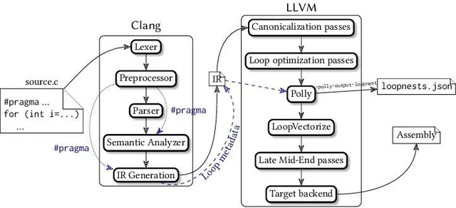

Our interpreter resolves a variable—tracks down which declaration it refers to—each and every time the variable expression is evaluated. If that variable is swaddled inside a loop that runs a thousand times, that variable gets re-resolved a thousand times.

A better solution is to resolve each variable use once. Write a chunk of code that inspects the user’s program, finds every variable mentioned, and figures out which declaration each refers to. This process is an example of a semantic analysis, and duty of the parser

we’ll know not just that an expression is a variable, but which variable it is, not when the code is interpreted at runtime but at the moment of parsing

we are writing a semantic analyzer with this one

variable resolution pass works like a sort of mini-interpreter. It walks the tree, visiting each node, but a static analysis is different from a dynamic execution:

There are no side effects. When the static analysis visits a print statement, it doesn’t actually print anything. Calls to native functions or other operations that reach out to the outside world are stubbed out and have no effect.

There is no control flow. Loops are visited only once. Both branches are visited in if statements. Logic operators are not short-circuited.

